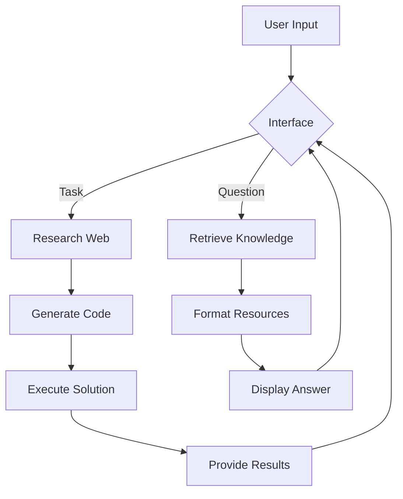

# Autonomous AI System - Hugging Face Space


## 🤖 About This Project

The Autonomous AI System is a self-improving artificial intelligence that can research, learn, code, and execute tasks to accomplish your goals. This innovative system features:

- **Task Execution**: Enter any goal and the AI will research online, generate code, execute solutions, and provide results
- **Learning Coach**: Get personalized education on any topic using vetted knowledge sources
- **Self-Improvement**: Automatically diagnoses and repairs its own systems
- **Cloud-Optimized**: Designed specifically for Hugging Face Spaces deployment

[](https://huggingface.co/spaces/Leonydis137/Autonomous-AI)

## ✨ Key Features

### 🚀 Task Execution Module
- Research any topic using web search
- Generate and execute Python code
- Self-diagnose system health
- Automatic error recovery
- Session tracking with unique IDs

### 🎓 Learning Coach
- Curated knowledge from trusted sources:
  - OpenStax textbooks
  - Khan Academy videos
  - Wikipedia summaries
  - arXiv research papers
- Adaptive explanations (Beginner/Advanced)
- Follow-up question suggestions
- Continuous improvement through feedback

### 💻 Technical Highlights
- Single-file architecture
- No persistent storage required
- Cloud-optimized for Hugging Face
- Efficient resource usage
- Modern Gradio interface

## 🧠 How It Works



## 🚀 Getting Started

### Using the Live Demo
1. Visit the [Hugging Face Space](https://huggingface.co/spaces/Leonydis137/Autonomous-AI)
2. In the **Task Execution** tab:
   - Enter a goal (e.g., "Scrape weather data from NOAA")
   - Click "Execute Goal"
   - View results and session ID
3. In the **Learning Coach** tab:
   - Ask a question (e.g., "Explain neural networks")
   - Select knowledge depth
   - Click "Get Answer"

### Running Locally
```bash
# Clone repository
git clone https://huggingface.co/spaces/Leonydis137/Autonomous-AI
cd Autonomous-AI

# Install dependencies
pip install -r requirements.txt

# Launch application
python app.py
```
Access at: http://localhost:7860

## 🧩 System Architecture

```
Autonomous AI System
├── Task Execution Engine
│   ├── Planner
│   ├── Web Searcher
│   ├── Code Generator
│   ├── Code Executor
│   └── System Critic
├── Learning Coach
│   ├── Knowledge Integrator
│   ├── Concept Extractor
│   ├── Resource Curator
│   └── Adaptive Explainer
└── Interface
    ├── Task Execution Tab
    └── Learning Coach Tab
```

## 🌐 Knowledge Sources

| Source | Content Type | Provider |
|--------|--------------|----------|
| OpenStax | Textbooks | Rice University |
| Khan Academy | Educational Videos | Khan Academy |
| Wikipedia | Summaries | Wikimedia |
| arXiv | Research Papers | Cornell University |

## ⚠️ Important Notes

1. **Code Execution Safety**:
   - Runs in isolated environment
   - Strict timeout limits (30 seconds)
   - No filesystem persistence
   
2. **Resource Limitations**:
   - Free Hugging Face Spaces have limited CPU/memory
   - Complex tasks may time out
   - For heavy workloads, use local deployment

3. **Learning Resources**:
   - Responses depend on API availability
   - Some sources may have rate limits
   - Results are automatically filtered for relevance

## 📜 License

This project is licensed under the [Apache 2.0 License](https://www.apache.org/licenses/LICENSE-2.0). 

```
Copyright 2023 Autonomous AI System

Licensed under the Apache License, Version 2.0 (the "License");
you may not use this file except in compliance with the License.
You may obtain a copy of the License at

    http://www.apache.org/licenses/LICENSE-2.0

Unless required by applicable law or agreed to in writing, software
distributed under the License is distributed on an "AS IS" BASIS,
WITHOUT WARRANTIES OR CONDITIONS OF ANY KIND, either express or implied.
See the License for the specific language governing permissions and
limitations under the License.
```

## 🙋‍♂️ Support & Contribution

For issues or feature requests:
- [Open an Issue](https://github.com/yourusername/autonomous-ai/issues)
- [Contribution Guidelines](CONTRIBUTING.md)

---

**Experience the future of autonomous AI systems today!**  
[](https://huggingface.co/spaces/Leonydis137/Autonomous-AI)
